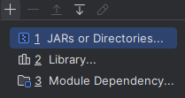
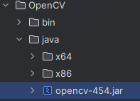
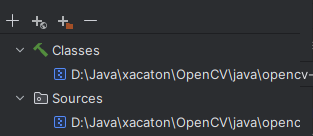
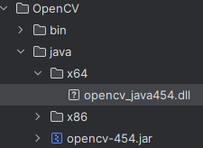

Для фронта, запросы идут по данным URL
-
- http://localhost:8080/cats/count - post-запрос с form-data файлом, получает изображение по ключевому слову "cat", отдает json с id, fileName, catsFirstCount, catsSecondCount
- http://localhost:8080/cats/getCats/{id} - get-запрос принимающий id вместо {id}, отдает все то же, что и предыдующий запрос, ничего не сохраняет
- http://localhost:8080/cats/getCatImage/{id} - get-запрос, принимающий id вместо {id}, отдает картинку с котом, которая была отправлена в первом запросе

Для запуска проекта
-
Подключить СУБД к проекту. 
В файле src/main/resources/application.properties поменять значение следующих строк (если нужно):
- spring.datasource.driver-class-name - Драйвер, для подключения к БД.
- spring.datasource.url - Ссылка на БД
- spring.datasource.username | spring.datasource.password - юзернейм и пароль от бд
- spring.jpa.properties.hibernate.dialect - диалект для работы с СУБД
- spring.jpa.properties.hibernate.show_sql - выводит запросы SQL в консоль при их выполнении

Запустить класс XacatonApplication, который находится в src/main/java/com/example/xacaton/XacatonApplication

Для правильной работы класса CatImageDetector сделать следующее
- 
- В Project Structure во вкладе Modules добавить в jars or directories модуль opencv-454 из папки OpenCV
 
 

- После нужно выбрать модуль opencv-454.jar, нажать edit и выбрать файл opencv_java454.dll в зависимости от разряда процессора
 
 

