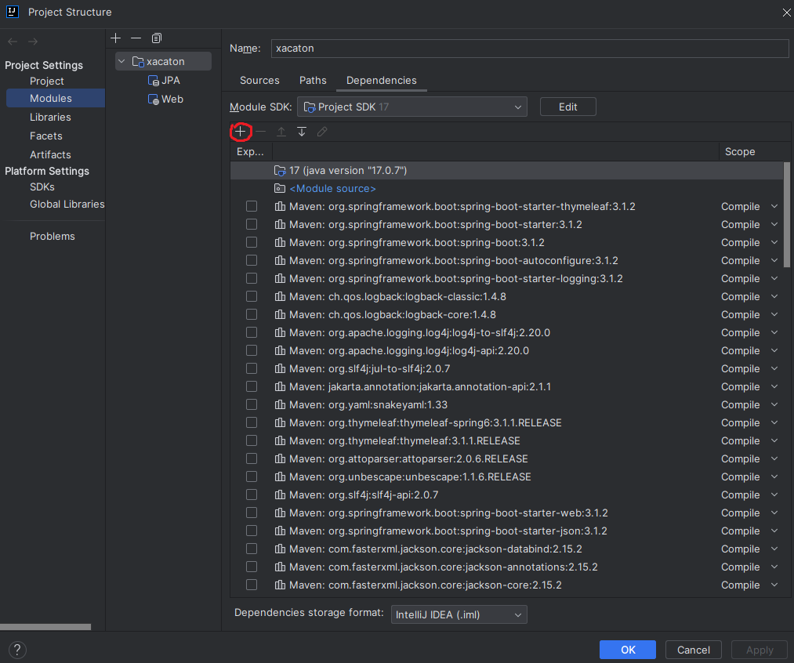

Для фронта, запросы идут по данным URL
-
- http://localhost:8080/cats/count - post-запрос с form-data файлом, получает изображение по ключевому слову "cat", отдает json с id, fileName, catsFirstCount, catsSecondCount
- http://localhost:8080/cats/getCats/{id} - get-запрос принимающий id вместо {id}, отдает все то же, что и предыдующий запрос, ничего не сохраняет
- http://localhost:8080/cats/getCatImage/{id} - get-запрос, принимающий id вместо {id}, отдает картинку с котом, которая была отправлена в первом запросе

Для запуска проекта
-
Запустить класс XacatonApplication, который находится в src/main/java/com/example/xacaton/XacatonApplication

Для правильной работы класса CatImageDetector сделать следующее
- 
- В Project Structure во вкладе Modules добавить в jars or directories модуль opencv-454 из папки OpenCV

- После нужно выбрать модуль opencv-454.jar, нажать edit и выбрать файл opencv_java454.dll в зависимости от разряда процессора

